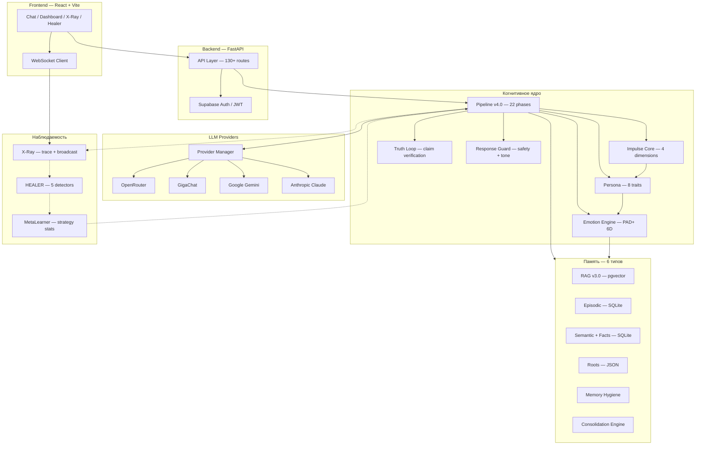
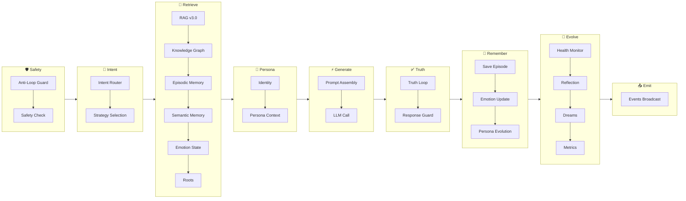
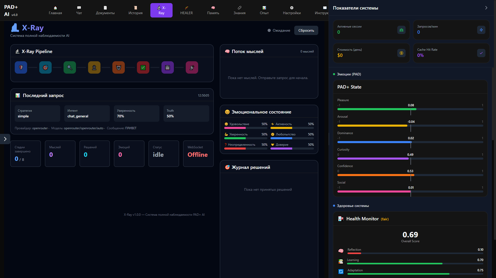
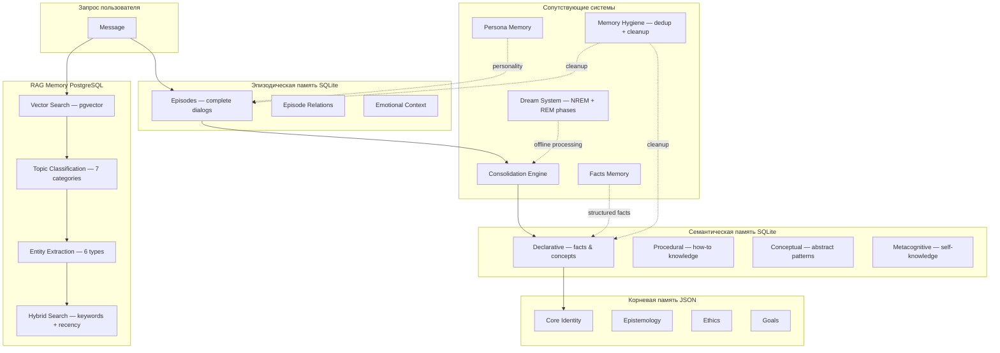

# PAD+ AI v4.0

<p align="center">
  <strong>Когнитивная архитектура для языковых моделей</strong>
</p>

<p align="center">
  
  
  
  
  
  
  
  
</p>

PAD+ AI — это слой между пользователем и языковой моделью, который не передаёт запрос напрямую, а проводит его через последовательность когнитивных фаз: от определения направленности мышления до верификации утверждений.

Система включает многослойную память (эпизодическая, семантическая, векторная), эмоциональную модель, эволюцию личности и полную трассировку каждого шага обработки. PAD+ AI не заменяет LLM и не конкурирует с ними — он исследует, какой может быть архитектура вокруг языковых моделей.

---

## Содержание

- [Philosophy](#philosophy)
- [Cognitive Hierarchy](#cognitive-hierarchy)
- [Core Principles](#core-principles)
- [What Makes PAD+ AI Different](#what-makes-pad-ai-different)
- [System Architecture](#system-architecture)
- [Cognitive Pipeline](#cognitive-pipeline)
- [Core Components](#core-components)
  - [Impulse Core (Cognitive Predisposition Layer)](#impulse-core)
  - [X-Ray](#x-ray)
  - [HEALER](#healer)
  - [Memory](#memory)
  - [Emotion Engine](#emotion-engine)
  - [Truth Loop](#truth-loop)
  - [Provider Manager](#provider-manager)
  - [Persona](#persona)
  - [RAG v3.0](#rag)
- [Memory Architecture](#memory-architecture)
- [Technology Stack](#technology-stack)
- [Repository Structure](#repository-structure)
- [Screenshots](#screenshots)
- [Quick Start](#quick-start)
- [Deployment](#deployment)
- [Documentation](#documentation)
- [Roadmap](#roadmap)
- [Contributing](#contributing)
- [License](#license)

---

## Philosophy

Большинство AI-приложений работают по одной схеме: запрос → LLM → ответ. Вся логика — в одном промпте. Система не имеет состояния, не помнит прошлого, не сомневается в своих ответах.

PAD+ AI построен на другой идее.

Перед тем как отправить запрос языковой модели, система проходит через последовательность когнитивных слоёв, каждый из которых изменяет состояние, влияющее на генерацию. LLM получает не сырой запрос, а контекст, уже сформированный личностью, эмоциями, памятью и направленностью мышления.

Проект исследует вопрос: **что должно произойти между получением запроса и генерацией ответа, кроме одного вызова модели?**

Это не чат-бот, не агент и не обёртка над API. Это исследовательская реализация когнитивной архитектуры, в которой каждый компонент изолирован, трассируется и может быть заменён независимо.

> PAD+ AI is not designed to imitate consciousness.  
> It is designed to preserve causal continuity of cognition across multiple reasoning layers.

---

## Cognitive Hierarchy

Процесс принятия решения в PAD+ AI следует вертикальной иерархии. Каждый уровень отвечает на свой вопрос и передаёт результат следующему:

```
                    IMPULSE CORE
            (когнитивная направленность)
                        │
              "Что сейчас важно?"
                        │
                        ▼

                     PERSONA
                (идентичность)
                        │
               "Кто принимает решение?"
                        │
                        ▼

                  EMOTIONS
              (аффективное состояние)
                        │
            "В каком состоянии система?"
                        │
                        ▼

                   MEMORY
               (извлечение знаний)
                        │
          "Что система вспоминает прямо сейчас?"
                        │
                        ▼

                 GENERATION
              (LLM + контекст)
                        │
              "Как ответить на это?"
                        │
                        ▼

                 TRUTH LOOP
               (верификация)
                        │
               "Правда ли это?"
                        │
                        ▼

                EVOLUTION
             (обновление состояний)
                        │
           "Что изменилось после ответа?"
                        │
                        ▼

                  RESPONSE
```

Эта иерархия — не абстракция. Каждый уровень реализован как изолированный модуль с собственными данными, API и тестами.

---

## Core Principles

<dl>
<dt><strong>Observability</strong></dt>
<dd>Каждый шаг обработки трассируется в реальном времени. X-Ray фиксирует все 22 фазы pipeline, решения о стратегии, изменения эмоций и результаты верификации. Система не имеет «тёмных» участков.</dd>

<dt><strong>Cognitive Predisposition</strong></dt>
<dd>Перед генерацией ответа система определяет направленность мышления через Impulse Core — четыре ортогональных измерения, смещающих априорные вероятности ответа без прямых инструкций.</dd>

<dt><strong>Memory as Ecosystem</strong></dt>
<dd>Память не единое хранилище, а иерархия слоёв: от сырых диалогов (RAG) через эпизоды к семантическим концепциям и неизменяемым принципам. Знания консолидируются между слоями автоматически.</dd>

<dt><strong>Identity</strong></dt>
<dd>Система имеет стабильную личность (persona) с чертами, ценностями и стилем общения. Личность эволюционирует на основе взаимодействий, но сохраняет ядро.</dd>

<dt><strong>Emotions</strong></dt>
<dd>Шестимерная модель PAD+ (Pleasure, Arousal, Dominance, Curiosity, Confidence, Social Connection) влияет на тон, многословность и стиль ответа. Эмоции затухают со временем и реагируют на события.</dd>

<dt><strong>Truth Verification</strong></dt>
<dd>Каждое утверждение в ответе проходит через Truth Loop — проверку на противоречия с внутренней памятью и оценку достоверности. Система может указать на неуверенность в ответе.</dd>

<dt><strong>Modularity</strong></dt>
<dd>Pipeline состоит из 22 независимых фаз. Каждая фаза — класс с единым интерфейсом. Фазы могут быть заменены, переставлены или отключены без изменения соседних компонентов.</dd>

<dt><strong>Reflection</strong></dt>
<dd>После каждого ответа система анализирует результат: сравнивает ожидаемую и фактическую уверенность, извлекает уроки, обновляет MetaLearner. Отдельный Dream System обрабатывает память в фоновом режиме.</dd>

<dt><strong>Explainability</strong></dt>
<dd>X-Ray записывает не только метрики, но и «мысли» системы на каждом этапе: почему выбрана эта стратегия, какие воспоминания извлечены, какие утверждения проверены. Это делает поведение системы интерпретируемым.</dd>
</dl>

---

## What Makes PAD+ AI Different

| | Conventional AI | PAD+ AI |
|---|---|---|
| **Response** | Responds to a prompt | Thinks through cognitive layers |
| **Context** | Retrieves from history | Preserves causal continuity across memory layers |
| **Interface** | Relies on prompt engineering | Uses a structured cognitive pipeline |
| **State** | Stateless per request | Maintains persistent emotional, personal and episodic state |

---

## System Architecture



---

## Cognitive Pipeline

Каждый запрос проходит через последовательность фаз. Фазы сгруппированы по функциональным этапам:



Pipeline включает 22 фазы, сгруппированные в 8 этапов: Safety → Intent → Retrieve → Persona → Generate → Truth → Remember → Evolve → Emit.

---

## Core Components

### Impulse Core

Impulse Core — верхний уровень когнитивной архитектуры. Он определяет **направленность мышления** до того, как подключены личность, эмоции и память.

В отличие от эмоций (которые описывают текущее состояние) или персоны (которая описывает стабильную идентичность), Impulse задаёт **когнитивную предрасположенность**: в каком направлении система будет обрабатывать запрос.

Impulse не является инструкцией. Модель не обязана ему следовать — он лишь смещает априорные вероятности ответа.

**Четыре измерения:**

| Измерение | Значение | Влияние |
|---|---|---|
| **Understand** | Желание понять | Глубокий анализ, извлечение знаний, интерпретация |
| **Improve** | Желание улучшить | Планирование, рефакторинг, самокоррекция |
| **Protect** | Сохранение целостности | Безопасность, верификация, стабильность |
| **Create** | Исследование и новизна | Креативность, синтез, новые идеи |

Impulse хранится как вектор из 4 весов (не нормированных к 1.0), поддерживает стек состояний (push/pop) и восстанавливается при перезапуске.

**Интеграция:** Impulse встраивается в системный промпт Generate Phase как `impulse_line`. Компоненты ниже по иерархии (Persona, Emotion, Memory) не зависят от Impulse напрямую — они обрабатываются параллельно, и их результаты объединяются на этапе сборки промпта.

---

### X-Ray

X-Ray — система полной наблюдаемости, встроенная в каждый запрос. Не логи и не метрики, а **структурированная трассировка с «мыслями» системы**.

**Как работает:**

1. TraceCollector создаёт сессию для каждого запроса
2. Каждая фаза pipeline записывает событие: название, длительность, статус, данные
3. ThoughtVisualizer генерирует человеко-читаемые «мысли» для ключевых фаз
4. Broadcaster отправляет события через WebSocket в реальном времени
5. После завершения — сессия закрывается и становится доступна для анализа

**Что логируется:**

- Выбор стратегии и причина
- Каждая из 22 фаз pipeline с длительностью
- Изменения эмоций
- Результаты верификации Truth Loop
- Ошибки и деградации
- Использованная модель и провайдер

**Что видит пользователь:**



Правая панель с вкладками:
- **Trace** — текущий запрос по этапам с длительностями
- **Thought Stream** — «мысли» системы на каждом шаге
- **History** — последние запросы
- **Stats** — latency, ошибки, модели

---

### HEALER

HEALER — подсистема самодиагностики и самовосстановления. Работает как подписка на события TraceCollector: после завершения каждой сессии запускает детекторы и при необходимости применяет remediation.

**Пять детекторов:**

| Детектор | Что проверяет | Действие |
|---|---|---|
| SlowPhasesDetector | Фазы pipeline, выполняющиеся дольше порога | Смена модели на более быструю |
| ErrorPathDetector | Ошибки без fallback | Включение safe-mode |
| BrokenPhasesDetector | Пропущенные обязательные фазы | Перезапуск проблемной фазы |
| ProviderHealthDetector | Стабильность провайдеров LLM | Понижение приоритета / исключение из ротации |
| StrategyDriftDetector | Деградация стратегии по времени и confidence | Смена стратегии |

**Режимы работы:**
- `monitor` — только логирование
- `suggest` — рекомендации (без автоматических изменений)
- `auto` — автоматическое применение remediation

HEALER реализован как отдельный модуль (121 тест, zero external dependencies) и интегрирован через `backend/healing/`.


---

### Memory

PAD+ AI использует шесть типов памяти, разделённых по назначению и времени жизни:

| Тип | Хранилище | Время жизни | Назначение |
|---|---|---|---|
| **RAG v3.0** | PostgreSQL / pgvector | Долгое | Векторный поиск по диалогам |
| **Episodic** | SQLite | Среднее | Полные эпизоды с эмоциональным контекстом |
| **Semantic** (включая Facts) | SQLite | Долгое | Концепции, процедурные знания, структурированные факты |
| **Roots** | JSON | Бесконечное | Фундаментальные принципы (неизменяемые) |
| **Persona** | SQLite | Долгое | Черты личности, ценности, стиль |
| **Hygiene** | — | Фоновый | Дедупликация, очистка устаревших записей |

Память поддерживает консолидацию: эпизоды → семантические концепции → принципы. Запускается автоматически каждые N диалогов.

---

### Emotion Engine

Шестимерная эмоциональная модель PAD+ (Pleasure, Arousal, Dominance, Curiosity, Confidence, Social Connection).

**Как работает:**

1. Каждое взаимодействие вызывает событие (user_praise, contradiction, new_knowledge и т.д.)
2. Событие изменяет параметры эмоций в соответствии с таблицей эффектов
3. Эмоции затухают со временем (0.001/сек) к нейтральным значениям
4. На основе текущего состояния вычисляется стиль ответа: тон (friendly/neutral/serious), многословность (concise/moderate/detailed), цвет (confident/balanced/uncertain)
5. Стиль встраивается в промпт Generate Phase

Эмоции не симулируют чувства — они формируют аффективный слой, влияющий на то, **как** система отвечает, а не **что** она говорит.

---

### Truth Loop

Truth Loop извлекает утверждения из ответа, сгенерированного LLM, и проверяет каждое на противоречия с внутренней памятью (факты, семантическая память, Roots).

**Процесс:**

1. Разбиение ответа на отдельные утверждения (claims)
2. Поиск подтверждений или противоречий в памяти для каждого утверждения
3. Оценка общей уверенности в ответе
4. Если уверенность ниже порога — добавление дисклеймера

Truth Loop не блокирует ответы, но информирует пользователя о степени достоверности.

---

### Provider Manager

ProviderManager — единый интерфейс ко всем LLM-провайдерам с автоматическим fallback.

**Поддерживаемые провайдеры:**

| Провайдер | Аутентификация | Бесплатный доступ |
|---|---|---|
| OpenRouter | API Key | Частично |
| GigaChat | OAuth (системный ключ) | ✅ |
| OpenAI | API Key | ❌ |
| Google Gemini | API Key | ✅ |
| Anthropic Claude | API Key | ❌ |
| Groq | API Key | ✅ |

**Fallback-логика:** Если первый провайдер недоступен (401, 429, 5xx, timeout), система пробует следующий по цепочке. Для OpenRouter fallback — GigaChat, для OpenAI — OpenRouter → GigaChat, и т.д.

---

### Persona

Persona — система личности с восемью чертами: curiosity, helpfulness, adaptability, creativity, skepticism, empathy, caution, openness.

**Что включает:**
- Числовые значения черт (0.0–1.0) со стабильностью каждой
- Ценности и принципы
- Стиль общения
- Историю саморефлексий

Persona эволюционирует: после каждого диалога черты могут незначительно меняться. Эволюция сохраняет ядро личности — изменения накапливаются постепенно.

---

### RAG

RAG v3.0 — семантическая память на PostgreSQL с гибридным поиском.

**Возможности:**
- Классификация тем (7 категорий: техническое, философское, личное, образовательное, творческое, аналитическое, бытовое)
- Извлечение сущностей (6 типов: person, technology, concept, location, time, number)
- Извлечение связей между сущностями (is_a, uses, related_to, part_of, contains)
- Гибридный поиск: ключевые слова + давность + семантическая близость
- LLM-суммаризация (опционально, через GigaChat)
- Фильтрация по пользователю и теме

---

## Memory Architecture



Consolidation Engine переносит знания снизу вверх: эпизоды осмысливаются в семантические концепции, концепции обобщаются до принципов в Roots. Dream System обрабатывает память в фоновом режиме, строя неожиданные связи между разрозненными эпизодами.

---

## Technology Stack

| Компонент | Технология |
|---|---|
| **Backend** | Python 3.11+, FastAPI, Uvicorn, Pydantic v2 |
| **Frontend** | React 18, Vite 5, Tailwind CSS 3, Recharts, D3 |
| **Database** | PostgreSQL 15 (Supabase) + SQLite |
| **Vector Search** | pgvector (PostgreSQL extension) |
| **Auth** | Supabase Auth (JWT) |
| **Cache** | Redis 7 (опционально) |
| **LLM Providers** | OpenRouter, GigaChat, OpenAI, Google Gemini, Anthropic Claude, Groq |
| **LLM Interface** | ProviderManager (единый SDK-интерфейс) |
| **Pipeline** | PipelineExecutor v4.0, 22 stages |
| **X-Ray** | TraceCollector + WebSocket Broadcaster + ThoughtVisualizer |
| **HEALER** | Self-contained module, zero external dependencies |
| **CI** | GitHub Actions (pytest, ruff, black, mypy) |
| **Deployment** | Render (Web Service + Static Site), Docker |
| **Testing** | pytest, 400+ test functions |

---

## Repository Structure

```
PAD+ AI/
├── backend/                    # FastAPI backend
│   ├── api/                    # 130+ routes
│   ├── core/                   # Ядро системы
│   │           ├── pipeline/           # Pipeline v4.0 (executor + phases)
│   │   ├── xray/               # X-Ray (trace, broadcast, visualization)
│   │   └── guard/              # Response Guard (safety, tone, cognition)
│   ├── emotion/                # PAD+ emotional model
│   ├── memory/                 # 6 типов памяти + consolidation + hygiene
│   ├── runtime/                # ProviderManager + LLMService
│   ├── healing/                # HEALER integration (detectors + remediation)
│   ├── autonomy/               # Autonomous processes (planner, scheduler)
│   └── knowledge/              # Knowledge Graph
├── frontend/                   # React + Vite frontend
│   └── src/
│       ├── pages/              # 12 страниц (Chat, X-Ray, Healer, Memory и др.)
│       ├── components/         # UI компоненты
│       └── services/           # API клиенты
├── HEALER/                     # Self-contained HEALER module
│   ├── healer/                 # Diagnostics, patcher, verifier, orchestrator
│   └── aethon/xray/            # X-RAY kernel (17 modules)
├── docs/                       # Документация
│   ├── architecture/           # Архитектурные документы (5 файлов)
│   └── impulse/                # Impulse Core документация
├── tests/                      # 400+ test functions
│   ├── test_pipeline/          # Pipeline тесты
│   ├── test_xray/              # X-Ray тесты
│   └── hardening/              # Hardening тесты
└── scripts/                    # Вспомогательные скрипты
```

---

## Screenshots

| Экран | Описание |
|---|---|
| `screenshots/dashboard.png` | Главная панель — метрики системы, эмоции, состояние памяти |
| `screenshots/chat.png` | Интерфейс чата с X-Ray панелью справа |
| `screenshots/xray.png` | X-Ray трассировка — мысли системы, этапы, ошибки |
| `screenshots/healer.png` | HEALER дашборд — детекторы, отчёты, remediation |
| `screenshots/memory.png` | Memory dashboard — статистика по всем типам памяти |
| `screenshots/documents.png` | Управление документами и коллекциями |
| `screenshots/providers.png` | Настройка LLM-провайдеров |
| `screenshots/history.png` | История диалогов с фильтрацией |
| `screenshots/settings.png` | Настройки пользователя |
| `screenshots/experience.png` | Experience и Impulse Core |
| `screenshots/knowledge.png` | Граф знаний |
| `screenshots/instructions.png` | Системные инструкции |

---

## Quick Start

```bash
# Клонирование
git clone <repository-url>
cd PAD-AI

# Backend
pip install -r requirements.txt
cp .env.example .env   # заполнить SUPABASE_*, ENCRYPTION_*, провайдеры
uvicorn backend.main:app --reload --port 8080

# Frontend (новый терминал)
cd frontend
npm install
npm run dev
```

Откройте `http://localhost:5174`.

**Требования:** Python 3.11+, Node.js 18+, PostgreSQL 15+, Redis 7+ (опционально).

---

## Deployment

### Render (облако)

Кнопка деплоя:

[](https://render.com/deploy)

**Backend:** Web Service — `render.yaml`
**Frontend:** Static Site — сборка `frontend/`, publish `frontend/dist`

### Переменные окружения

| Переменная | Описание |
|---|---|
| `SUPABASE_URL` | URL проекта Supabase |
| `SUPABASE_KEY` | Публичный anon key |
| `SUPABASE_SERVICE_KEY` | Service role key (только backend) |
| `ENCRYPTION_KEY` | Ключ шифрования (base64, 32 байта) |
| `ENCRYPTION_SALT` | Соль шифрования (base64, 32 байта) |
| `CSRF_SECRET_KEY` | CSRF-секрет |
| `FRONTEND_URL` | URL фронтенда для CORS |
| `DATABASE_URL` | PostgreSQL connection string |
| `REDIS_URL` | Redis connection string (опционально) |

### Docker

```bash
docker build -t padplus-backend .
docker run -d --name padplus -p 8080:8080 --env-file .env padplus-backend
```

---

## Documentation

| Документ | Описание |
|---|---|
| [ARCHITECTURE.md](docs/ARCHITECTURE.md) | Архитектура системы, pipeline, память, эмоции |
| [API.md](docs/API.md) | Полная спецификация API (28 разделов) |
| [RELEASE_v4.0.md](docs/RELEASE_v4.0.md) | Манифест релиза, известные ограничения, чек-листы |
| [XRAY.md](docs/XRAY.md) | X-Ray система наблюдаемости |
| [XRAY_GUIDE.md](docs/XRAY_GUIDE.md) | Руководство по X-Ray тестированию |
| [DEPLOYMENT.md](docs/DEPLOYMENT.md) | Развёртывание на production |
| [RLS_POLICIES.md](docs/RLS_POLICIES.md) | Row Level Security политики |
| [PROJECT_STRUCTURE.md](docs/PROJECT_STRUCTURE.md) | Полная структура проекта |
| [SELF_HEALING_ARCHITECTURE.md](docs/SELF_HEALING_ARCHITECTURE.md) | Архитектура HEALER |
| [IMPULSE_CORE.md](docs/impulse/IMPULSE_CORE.md) | Концепция Impulse Core |
| [IMPULSE_ARCHITECTURE.md](docs/impulse/IMPULSE_ARCHITECTURE.md) | Интеграция Impulse в систему |

Документация по подсистемам: [docs/architecture/](docs/architecture/) — Overview, Pipeline, Memory System, Emotion System, Meta System.

---

## Roadmap

```
✓ v1 — Episodic + Semantic Memory
✓ v2 — RAG + Vector Search
✓ v3 — Personality + Emotion Engine
✓ v4 — Cognitive Pipeline (current)

---
▲ v4.1 — Security audit, HEALER isolation, CORS hardening
△ v4.2 — Multi-worker, async consolidation, structured logging
○     — Cognitive Observatory, Self Evolution, Multi-Agent
```

---

## Contributing

Pull Request'ы приветствуются. Основные правила:

1. **Перед изменениями** — откройте Issue с описанием предлагаемого изменения
2. **Код** — соответствует PEP 8, типизирован, покрыт тестами
3. **Тесты** — `pytest tests/` должен проходить полностью
4. **X-Ray тесты** — для изменений в pipeline обязательны тесты через TraceCollector (см. [XRAY_GUIDE.md](docs/XRAY_GUIDE.md))
5. **Документация** — изменения API отражаются в [API.md](docs/API.md)

**Сообщение об ошибке:** открывайте Issue с метками `bug`, прикладывайте trace из X-Ray и логи.

---

## License

Apache License 2.0. См. [LICENSE](LICENSE).

---

PAD+ AI исследует вопрос: **что происходит между получением запроса и появлением ответа?**

Этот проект не пытается заменить языковые модели и не конкурирует с ними. Он исследует, какой может быть когнитивная архитектура вокруг них — какие слои необходимы, как они взаимодействуют, как сделать поведение системы прозрачным и интерпретируемым.

Система не утверждает, что обладает сознанием, чувствами или пониманием. Impulse, эмоции, личность и память — это инженерные конструкции, созданные для исследования когнитивных архитектур поверх современных языковых моделей.
